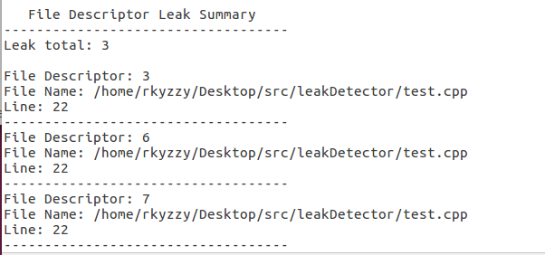

# CS302 Project Final Report

#### --11812202 Weibao Fu

#### --11810935 Lan Lu

#### --11811127 Ziyue Zhou


## Result Analysis

#### 1)How we met expected goals:


1. **Collect real-time memory usage statistics from every existed process**

   
   
   It collect real-time memory usage statistic and list it as a terminal output above
   
   First two lines are the memory analysis result in total, including `Total Memory` , `Used Memory` , `Cached Memory` and `Free Memoy`
   
   Following is a table for statistic for each process. Each row in a table represents a process with its `PID`, `NAME` , `STATE` , `VMSIZE` , `VMRSS` , `%VMSIZE` , `%VMRSS`
   
   It also gives a real-time warning over the parameter `%VMRSS`
   
   if    `%VMRSS` < 10, it is considered as within the `MEMSAFE` line  then the  row item appears as green
   
   if   20>`%VMRSS` >10, it is considered as cross the `MEMSAFE` line , then the row item appears as yellow
   
   
   
   if  30 > `%VMRSS` >20,  it is considered as cross the `MEMWARN` line , then the row item appears as red
   
   

​       if   `%VMRSS` >30,  it is considered as cross the `MEMDANGER` line , then the row item appears as red and keeps flashing. (since it is dynamic, it cannot be shown in the report)

2. **Rank and display memory usage statistics.**

   The memory usage statistics can be sorted by 4 parameters, `PID` , `VMRSS`, `VMSIZE` ,`VMSTATE` :

   Sorted by `PID` (`-s0`):

   

   Sorted by `VMRSS`(`-s1`):

   

   Sorted by `VMSIZE`(`-s2`):

   

   Sorted by `STATE`(`-s2`):

   

   ```
   RUNNING > SLEEPING > IDLE > ZOMBIE > WAITING > STOPPED
   ```

   

   ***For a test program like this:***

   ```cpp
   using namespace std;
   
   int main() {
       int index = 5;
       int p[5];
       void * ptr[5];
       while(index --) {
           p[index] = open("test_file.cpp",0);
           ptr[index]=malloc(32*index);
           sleep(2);
       }
       close(p[2]);
       free(ptr[1]);
       sleep(2);
       close(p[3]);
       free(ptr[4]);
       sleep(2);
       mem_report();
       file_report();
   }
   ```

   ***Here are the following result analysis according to the test:***

   

3. **Detect and record memory allocation  and release status for specific processes.**

   

   Memory allocation and release status is recorded and written into a file in a format as above.

   The format:

   ```
   [Free/Allocated Memory]
   File: <File path directory>
   Line: <The line that convokes the memory allocation or free>
   Size: <The size of memory allocated or freed>
   ```

   

4. **Detect and record file handle allocation  and release status for specific processes.**

   

   File handle allocation and release status is also recorded and written into a file as a format above

   ```
   [Closed/Opened File]
   File: <File path directory>
   File Descriptor: <The file descriptor it returns>
   Line: <The line that convokes the file open or close>
   ```

   

5. **Detect and report potential memory leak according to the tracked allocation and release information.**

   

   

   It will print out a Memory Leak Summary report at the end.

   It records

   (1) `Leak Total Num` : The total number of memory leak

   (2) `Leak Total Size`:  The total size of memory leak

   (3) `Max used` : The max total memory it uses during this time period

   (4) `Once Max` : The max amount of memory allocated at one allocation

   For each memory leak, it has the following format:

   ```
   Address: <The address in the memory where memory leak happens>
   Size: <The size of memory it leaks>
   File Name: <The file that the leakage happens>
   Line: <The line that causes the leakage happens>
   ```

   

#### 2) More Advanced goals acheived:

 1. **Made a file descriptor leak summary report:**

    

    t will print out a File Descriptor Leak Summary report at the end.

    It records

     `Leak Total` : The total number of file descriptor leak

    For each memory leak, it has the following format:

    ```
    File Descriptor: <The File Descriptor that it leaks>
    File Name: <The file that the leakage happens>
    Line: <The line that causes the leakage happens>
    ```

	2. **Display memory/file leakage real time detection statistic in terminal:**
	
	   

#### 3) Goals that are not implemented and its difficulties:

1. Detect and alert use on uninitialized memory.

2. Detect and alert read and write operations on memory after it has been freed.

3. Detect and alert use on memory beyond the allocated size.

   **Difficulties:** 

   Because we cannot perform a real-time monitoring over variables, we currently just provided a user interface for checking whether the operated address is valid.


## Implementation

#### 1) Overall Implementation ideas:

`MemStat` implementation overall idea:

All the process and its status is stored as file in dir: `/proc` , what we have to do is to iterate over this directory to get all process with each of its PID and then use the pid to access `"/proc/" + pid + "/status"` to get the status file of each process, and then find the information that has the key that we are looking for and record it and visualize it in the command line. Same for the memory info (stored in `"/proc/meminfo"`)

`LeakDetector` implementation overall idea:

We rewrite wrapper function for all memory related function (`malloc()`, `calloc()` , `realloc()`, `strdup()` , `free()`) and file related function (`open()` , `close()`) , For each allocation/open function rewrite, we record the  allocation/open action's related information and format it and write it in an output file, we also maintain a leak linked-list and insert it into the linked-list . For each memory/file resource release function rewrite, we also record the release action with its related information and format it and then write it in an output file, we also delete it from the leak linked-list. After the test finished, the memory/file that allocated/opened but not freed/closed will still remain in the leak linked-list, so we can detect the leakage and output it as a memory report.


#### 2) Implementation detail for each expected goals:

1. **Collect real-time memory usage statistic for every existed process**

   ```cpp
   vector<processMemInfo> getAllMemStat() {
       // update currentMemInfo
       MemInfo::getCurMemInfo();
   
       vector<string> processList;
       vector<processMemInfo> processMemInfoList;
   
       getProcessList("/proc", processList);
       for(int i=0;i<processList.size();++i){
           getProcessInfo(processList[i],processMemInfoList);
       }
   
       return processMemInfoList;
   }
   ```

​      We first get process list :

```cpp
void getProcessList(string path, vector<string>& processList){
    DIR *pDir;
    struct dirent* ptr;
    if (!(pDir = opendir(path.c_str()))) return;
    while ((ptr = readdir(pDir))!=0) {
        if (strcmp(ptr->d_name, ".") && strcmp(ptr->d_name, "..") && isProcess(ptr->d_name)) {
            processList.push_back(ptr->d_name);
        }
    }
}
```

Then for each process we find its status file and get its information by key, also calculate some information for utilization:

```cpp
void getProcessInfo(string pid, vector<processMemInfo>& processMemInfoList) {
    string statFilePath = "/proc/" + pid + "/status";
    fstream statFile (statFilePath, ios_base::in);

    if (statFile.fail()) {
        return;
    }

    processMemInfo info;

    /* To retrieve the infomation we want */
    string key;
    while ( !statFile.eof() ) {
        statFile >> key;
        // Caused by the last empty line
        if (statFile.fail()) break;

        /* The key we are looking for */
        if ( key == "Name:" ) {
            statFile >> info.name;
        } else if ( key == "State:" ) {
            getState(statFile, info.state);
        } else if ( key == "Pid:" ) {
            getInteger(statFile, info.pid);
        } else if ( key == "VmSize:" ) {
            getInteger(statFile, info.vmsize);
        } else if ( key == "VmRSS:" ) {
            getInteger(statFile, info.vmrss);
        }
        clearLine(statFile);
    }

    getUtilization(&info);
    processMemInfoList.push_back(info);
}
```

The utilization calculation is as follows:

```cpp
void getUtilization(processMemInfo* info) {
    info->vmsize_per = round((info->vmsize * 10000.0) / TOTAL_VM_SIZE) / 100.0;
    info->vmrss_per = round((info->vmrss * 10000.0) / MemInfo::m_total) / 100.0;
}
```

The `vmsize_per` represents the percentage of `vmsize` portion in`TOTAL_VM_SIZE`

While the `vmrss_per` represents the percentage of `vmrss` portion in `MemInfo::m_total`

Memory information is retrieved and recorded in the following manner:

```cpp
void MemInfo::getCurMemInfo(){
    fstream statFile ("/proc/meminfo", ios_base::in);

    if (statFile.fail()) {
        printf ("Fail to open /proc/meminfo\n");
        return;
    }

    /* To retrieve the infomation we want */
    string key, value;
    while ( !statFile.eof() ) {
        statFile >> key;
        // Caused by the last empty line
        if (statFile.fail()) break;

        /* The key we are looking for */
        if ( key == "MemTotal:" ) {
            getInteger(statFile, m_total);
        } else if ( key == "MemFree:" ) {
            getInteger(statFile, m_free);
        } else if ( key == "Buffers:" ) {
            getInteger(statFile, m_buffers);
        } else if ( key == "Cached:" ) {
            getInteger(statFile, m_cached);
        }
        clearLine(statFile);
    }

    m_used = m_total - m_free -m_buffers - m_cached;
}
```

It reaches `/proc/meminfo` to get the info and extract four keys: `MemTotal` , `MemFree`, `Buffers` , `Cached`, it also calculate `m_used` based on the previous four parameter.

At last, a terminal visualization is implemented, to make this real-time memory usage statistic be interpreted in a more elegant way:

```cpp
void displayHelp();
void displayTitle();
void displayEachItem(vector<processMemInfo> (*memStatFunc)(), int displayNum);
void displayMemoryInfo(processMemInfo info);

void setForeGoundColor(ForeGroundColor color);
void setBackGroundColor(BackGroundColor color);
void setFontBold();
void setFlash();
void resetDisplay();

void clearScreen();
void moveCursorLineHead();
void showCursor();
void hideCursor();
void UpCursor(int up);
```

The above are the function implemented for display use. The name of the function explain itself.


2. **Rank and display memory usage statistics.**

   We use `sortRegulation` and a switch statement to let the user decide which way of sorting should we present:

   ```cpp
       if (!checkArgs(displayNum, sortRegulation)) return 0;
   
       vector<processMemInfo> (*memStatFunc)();
       switch (sortRegulation) {
           case 0: { memStatFunc = &getMemStatByPid; break; }
           case 1: { memStatFunc = &getMemStatByVmrss; break; }
           case 2: { memStatFunc = &getMemStatByVmsize; break; }
           case 3: { memStatFunc = &getMemStatByState; break; }
           default: memStatFunc = &getMemStatByVmrss;
       }
   ```

   The specific method for each sort regulation:

   ```cpp
   vector<processMemInfo> getMemStatByPid() {
       vector<processMemInfo> processMemInfoList = getAllMemStat();
       sort(processMemInfoList.begin(), processMemInfoList.end(), MemCmpPid);
       return processMemInfoList;
   }
   
   vector<processMemInfo> getMemStatByState() {
       vector<processMemInfo> processMemInfoList = getAllMemStat();
       sort(processMemInfoList.begin(), processMemInfoList.end(), MemCmpState);
       return processMemInfoList;
   }
   
   vector<processMemInfo> getMemStatByVmsize() {
       vector<processMemInfo> processMemInfoList = getAllMemStat();
       sort(processMemInfoList.begin(), processMemInfoList.end(), MemCmpVmsize);
       return processMemInfoList;
   }
   
   vector<processMemInfo> getMemStatByVmrss() {
       vector<processMemInfo> processMemInfoList = getAllMemStat();
       sort(processMemInfoList.begin(), processMemInfoList.end(), MemCmpVmrss);
       return processMemInfoList;
   }
   ```

   The specific compare method for each sorting:

   ```cpp
   /* Compare Function */
   bool MemCmpPid(const processMemInfo& a,const processMemInfo& b) {
       return a.pid < b.pid;
   }
   
   bool MemCmpState(const processMemInfo& a,const processMemInfo& b) {
       if (a.state == b.state) return a.pid < b.pid;
       return a.state < b.state;
   }
   
   bool MemCmpVmsize(const processMemInfo& a,const processMemInfo& b) {
       return a.vmsize > b.vmsize;
   }
   
   bool MemCmpVmrss(const processMemInfo& a,const processMemInfo& b) {
       return a.vmrss > b.vmrss;
   }
   ```

   To clarify more on the state comparison, if two process are in the same state, it is ranked by pid , if not then it rank as the follow order:

   ```cpp
   RUNNING > SLEEPING > IDLE > ZOMBIE > WAITING > STOPPED
   ```

3.**Detect and record memory allocation  and release status for specific processes.**

​		For memory allocation and release status, we rewrite  related function (`malloc()`, `calloc()` , `realloc()`, `strdup()` , 		  `free()`) by adding the process of recording it (`add_mem_info (ptr, size, file, line)` and`remove_mem_info(mem_ref, file, line)`):

For example, for `malloc()` it is rewrite as the following:

```cpp
void * wrapper_malloc(unsigned int size, const char * file, unsigned int line) {
    void * ptr = malloc(size);
    if (ptr != NULL) {
        add_mem_info (ptr, size, file, line);
    }
    return ptr;
}
```

the `add_mem_info` function is like this:

```cpp
void add_mem_info(void * mem_ref, unsigned int size, const char * file, unsigned int line) {
    Mem_info mem_info;
    memset( &mem_info, 0, sizeof(mem_info) );
    mem_info.address = mem_ref;
    mem_info.size = size;
    mem_info.file_name = file;
    mem_info.line = line;
    if (!leak_info.is_first) {
        leak_info.is_first ++;
        MUTEX_CREATE(leak_info.mutex);
        FILENAME = string(strtok((char *)(string(file)).c_str(), "."));
        string DIRNAME = string(getcwd(NULL, 0)) + "/Output/";
        if (access(DIRNAME.c_str(), F_OK)) {
            mkdir(DIRNAME.c_str(),ALLPERMS);
        }
        FILENAME = DIRNAME + string(basename(FILENAME.c_str())) + "_Mem.txt";
        FILE *f = fopen(FILENAME.c_str(), "w");
        fclose(f);
    }

    MUTEX_LOCK(leak_info.mutex);
    insert_leak(mem_info);
    MUTEX_UNLOCK(leak_info.mutex);

    FILE *f = fopen(FILENAME.c_str(), "a");
    if (f!=NULL) {
        fprintf(f, "[Allocate Memeory]\nFile: %s\nLine: %d\nSize: %zu bytes\n\n", file, line, size);
        fclose(f);
    }
}
```

Allocation information is being recorded and written to output files 

`Mem_info` is a structure defined as follow, it records the address, size of these chunk of memory, file_name and line that takes operation on this chunk of memory:

```cpp
typedef struct _mem_info {
    void * address;
    unsigned int size;
    std::string file_name;
    unsigned int line;
} Mem_info ;
```

For wrapper function of others (`calloc()` , `realloc()`, `strdup()`), it is the same.

For wrapper function of `free()` , it calls `remove_mem_info(mem_ref, file, line) ` in it 

```cpp
void * wrapper_free(void * mem_ref, const char * file, unsigned int line) {
    remove_mem_info(mem_ref, file, line);
    free(mem_ref);
}
```

the `remove_mem_info` function is like this:

```cpp
void remove_mem_info(void * mem_ref, const char * file, unsigned int line) {
    Mem_leak * mem_leak = leak_start;
    bool success = 0;
    unsigned int size;

    MUTEX_LOCK(leak_info.mutex);
    for (unsigned int i = 0; mem_leak!=NULL; ++i) {
        if (mem_leak->mem_info.address == mem_ref) {
            size = delete_leak(i);
            success = 1;
            break;
        }
        mem_leak = mem_leak->next;
    }
    MUTEX_UNLOCK(leak_info.mutex);

    if (!success) {
        printf("Failure: remove memory.\n");
    } else {
        FILE *f = fopen(FILENAME.c_str(), "a");
        if (f!=NULL) {
            fprintf(f, "[Free Memeory]\nFile: %s\nLine: %d\nSize: %zu bytes\n\n", file, line, size);
            fclose(f);
        }
    }
}
```

It also record the action of memory free and its information by writing it into the output file.

4.**Detect and record file handle allocation  and release status for specific processes.**

The implementation is almost the same as *3.*

What's different is that the function it rewrites wrapper function is `open()` and  `close()`

in `add_file_info()` and `remove_file_info` , it outputs into a different destination file to be distinguished from memory. 

```cpp
    if (!leak_info.is_first) {
        leak_info.is_first ++;
        MUTEX_CREATE(leak_info.mutex);
        FILENAME = string(strtok((char *)(string(file)).c_str(), "."));
        string DIRNAME = string(getcwd(NULL, 0)) + "/Output/";
        if (access(DIRNAME.c_str(), F_OK)) {
            mkdir(DIRNAME.c_str(),ALLPERMS);
        }
        FILENAME = DIRNAME + string(basename(FILENAME.c_str())) + "_File.txt";
        FILE *f = fopen(FILENAME.c_str(), "w");
        fclose(f);
    }

```

Also the record format is different:

```cpp
    FILE *f = fopen(FILENAME.c_str(), "a");
    if (f!=NULL) {
        fprintf(f, "[Open File]\nFile: %s\nFile Descriptor: %d\nLine: %d\n\n", file, fd, line);
        fclose(f);
    }
```


5. **Detect and report potential memory leak according to the tracked allocation and release information.**

`Mem_leak` is defined as this kind of structure, it records the Mem_info of the leakage and the pointer to the next mem_leak:

```cpp
typedef struct _mem_leak {
    Mem_info mem_info;
    struct _mem_leak *next;
} Mem_leak ;
```

`Mem_Leak_info` is defined as the following :

```cpp
typedef struct _mem_leak_info {
    int num;
    unsigned int total_memory;
    unsigned int used_max;
    unsigned int once_max;
    bool is_first;
    pthread_mutex_t mutex;
} Mem_Leak_info ;
```

When performing  `add_mem_info`  , we perform an exclusive operation of  inserting leak (`insert_leak()`):

```cpp
    MUTEX_LOCK(leak_info.mutex);
    insert_leak(file_info);
    MUTEX_UNLOCK(leak_info.mutex);
```

A mutex lock is implemented to ensure to avoid concurrency mistake during changing of the leak linked-list.

The insert_leak function is like:

```cpp
void insert_leak(File_info fd_info) {
    File_leak * file_leak = new File_leak();
    file_leak->file_info = fd_info;
    file_leak->next = NULL;

    if (leak_start == NULL) {
        leak_start = file_leak;
        leak_next = file_leak;
    } else {
        leak_next->next = file_leak;
        leak_next = leak_next->next;
    }

    leak_info.num ++;
}
```

Same for the leak deletion when `remove_mem_info` 

This is leak deletion implementation:

```cpp
void delete_leak(int pos) {
    File_leak *fd_info = leak_start;
    File_leak *close_info = leak_start;
    if (pos == 0) {
        leak_start = leak_start->next;
    } else {
        unsigned int i = pos - 1;
        while (i--) fd_info = fd_info->next;
        close_info = fd_info->next;
        fd_info->next = close_info->next;

        if (leak_next == close_info) {
            leak_next = fd_info;
        }
    }

    free(close_info);
    leak_info.num --;
}
```

At last, when program finishes, it will report the leak summary by examining the remaining element in the leak linked list, and generate and output the report using the following function:

```cpp
void file_report() {
    File_leak * leak_item;
    FILE *f = fopen(FILENAME.c_str(), "a");
    if (f!=NULL) {
        fprintf(f, "   File Descriptor Leak Summary\n");
        fprintf(f, "-----------------------------------\n");
        fprintf(f, "Leak total: %d\n\n", leak_info.num);
        
        for (leak_item = leak_start; leak_item!= NULL; leak_item = leak_item->next) {
            fprintf(f, "File Descriptor: %d\nFile Name: %s\nLine: %d\n", 
                leak_item->file_info.fd, leak_item->file_info.file_name.c_str(), leak_item->file_info.line);
            fprintf(f, "-----------------------------------\n");
        }
        fclose(f);
    }
    file_clear();
    MUTEX_DESTROY(leak_info.mutex);
}
```

Thus, the expected goal is reached.

6. **Made a file descriptor leak summary report:**

   Same as ***5*.**  , we defined `File_leak` and `File_Leak_info` 

   ```cpp
   typedef struct _file_leak {
       File_info file_info;
       struct _file_leak *next;
   } File_leak ;
   
   typedef struct _leak_info {
       int num;
       bool is_first;
       pthread_mutex_t mutex;
   } File_Leak_info ;e
   ```

   we also have `insert_leak` and `delete_leak` for file:

   and a summary report display function `file_report` for file:

   ```cpp
   void insert_leak(File_info fd_info);
   void delete_leak(int pos);
   
   void file_report();
   ```

7. **Display memory/file leakage real time detection statistic in terminal:**

File implementation is almost the same as memory , so take memory as an example

The key different function in the display is  `getAllMemLeak()`

```cpp
vector<Mem_info> getAllMemLeak(){
    vector<Mem_info> memLeakList;
    FILEPATHRECORD = string(getcwd(NULL, 0)) + "/Output";
    DIR* dir = opendir(FILEPATHRECORD.c_str());
    dirent* p = NULL;
    string format = "_Mem.txt";
    while((p = readdir(dir)) != NULL)
    {
        if(p->d_name[0] != '.')
        {
            string name = FILEPATHRECORD + "/" + string(p->d_name);
            if(strstr(name.c_str(), format.c_str()) != NULL){

                FILE *f = fopen(name.c_str(), "r");
                if(f!=NULL) {
                    int mode = 0;
                    void *address;
                    unsigned int size;
                    string file_name;
                    unsigned int line;
                    time_t start;

                    string str = "";
                    char in[100];
                    while (NULL != fgets(in, 99, f)) {
                        if (in[0] == '\n')
                            continue;
                        str = in;
                        if (str == "[Allocate Memory]\n") {
                            mode = 1;
                            continue;
                        } else if (str == "[Free Memory]\n") {
                            mode = -1;
                            continue;
                        } else if (str == "       Memory Leak Summary\n")
                            break;
                        str.erase(remove(str.begin(), str.end(), '\n'), str.end());
                        if (str.size() > 7) {
                            if (str.substr(0, 7) == "Address")
                                address = (void *) (atoi(str.substr(11, 8).c_str()));
                            else if (str.substr(0, 4) == "File") {
                                file_name = str.substr(6);
                            } else if (str.substr(0, 4) == "Line") {
                                line = atoi(str.substr(6).c_str());
                            } else if (str.substr(0, 4) == "Size") {
                                size = atoi(str.substr(6).c_str());
                            } else if (str.substr(0, 5) == "Start") {
                                start = atol(str.substr(7).c_str());
                                if (mode == 1) {
                                    Mem_info mem_info;
                                    memset(&mem_info, 0, sizeof(mem_info));
                                    mem_info.address = address;
                                    mem_info.size = size;
                                    mem_info.file_name = file_name;
                                    mem_info.line = line;
                                    mem_info.start = start;
                                    memLeakList.push_back(mem_info);
                                } else if (mode == -1) {
                                    int find = -1;
                                    for (int i = 0; i < memLeakList.size(); i++) {
                                        if (memLeakList[i].address == address) {
                                            find = i;
                                            break;
                                        }
                                    }
                                    if (find > -1)
                                        memLeakList.erase(memLeakList.begin() + find);
                                }
                            }
                        }

                    }
                    fclose(f);
                }
            }
        }
    }
    closedir(dir);

    return memLeakList;
}
```

The function mainly gets memory statistic output file's record and leak summary report to construct the content of visualization , it also contains three mode for sort the display result which is :

```cpp
vector<Mem_info> getMemLeakByName() {
    vector<Mem_info> memLeakList = getAllMemLeak();
    sort(memLeakList.begin(), memLeakList.end(), LeakCmpName);
    return memLeakList;
}

vector<Mem_info> getMemLeakBySize() {
    vector<Mem_info> memLeakList = getAllMemLeak();
    sort(memLeakList.begin(), memLeakList.end(), LeakCmpSize);
    return memLeakList;
}

vector<Mem_info> getMemLeakByTime() {
    vector<Mem_info> memLeakList = getAllMemLeak();
    sort(memLeakList.begin(), memLeakList.end(), LeakCmpTime);
    return memLeakList;
}
```

Each sort has its comparison function:

```cpp
bool LeakCmpName(const Mem_info& a,const Mem_info& b) {
    return a.file_name < b.file_name;
}

bool LeakCmpSize(const Mem_info& a,const Mem_info& b) {
    return a.size < b.size;
}

bool LeakCmpTime(const Mem_info& a,const Mem_info& b) {
    return a.start < b.start;
}
```

For the display part, it is using almost the same display technique used in `memStat` and have the following function:

```cpp
void displayHelpMemLeak();
void displayTitleMemLeak();
void displayEachMem(vector<Mem_info> (*memLeakFunc)(), int displayNum);
void displayMemoryLeak(Mem_info leak, time_t second);
```

For the color warning, we have the following code:

```cpp
    if (second > LEAKDANGER) {
        setFlash();
        BGColor = BG_RED;
    } else if (second > LEAKWARN) {
        BGColor = BG_RED;
    } else if (second > LEAKSAFE) {
        BGColor = BG_YELLOW;
    } else {
        BGColor = BG_GREEN;
    }
```

The parameter `LEAKSAFE` `LEAKWARN` and  `LEAKDANGER` serves as the border line for each display color or form.

```cpp
const float LEAKSAFE = 10;
const float LEAKWARN = 20;
const float LEAKDANGER = 30;
```


## Future Direction

1. Detect and alert use on uninitialized memory.
2. Detect and alert read and write operations on memory after it has been freed.
3. Detect and alert use on memory beyond the allocated size.


## Summary

#### 1)Main techniques we learnt in the project

​      We learnt how to code in cpp and in ubuntu environment comfortably, we learnt an efficient way to detect memory/file leakage and realize the importance of doing so. We learn the way to visualize our result in linux terminal. We apply what we learnt in the CS302 OS courses such as memory , mutex lock, file and by doing the project we gain a deeper understanding over these area.

#### 2)Experience of teamwork

​      In this project, all of our teammates collaborate closely. The work division is clear and we have a lot of discussion sessions to fully exchange our ideas over the implementation. We also uses github as a collaboration and version control tool. Everybody is happy and proud of the project progress we've made


## Division of labor

**Weibao Fu's work:**  Implement code of Leak detector

**Lan Lu's work:**  Implement visualization part and part of memStat

**Ziyue Zhou's work:**  Implement code of memStat  and report writing