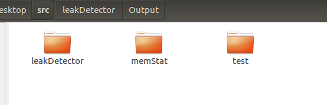

# CS302 Project Final Report

#### --11812202 Weibao Fu

#### --11810935 Lan Lu

#### --11811127 Ziyue Zhou


## Result Analysis

#### 1)How we met expected goals:


1. **Collect real-time memory usage statistics from every existed process**

   
   
   It collect real-time memory usage statistic and list it as a table above
   
   Each row in a table represents a process with its `PID`, `NAME` , `STATE` , `VMSIZE` , `VMRSS` , `%VMSIZE` , `%VMRSS`
   
   It also gives a real-time warning over the parameter `%VMRSS`
   
   if    `%VMRSS` < 10, it is considered as within the `MEMSAFE` line  then the  row item appears as green
   
   if   20>`%VMRSS` >10, it is considered as cross the `MEMSAFE` line , then the row item appears as yellow
   
   if  30 > `%VMRSS` >20,  it is considered as cross the `MEMWARN` line , then the row item appears as red

​       if   `%VMRSS` >30,  it is considered as cross the `MEMDANGER` line , then the row item appears as red and keeps flashing.


2. **Rank and display memory usage statistics.**

   The memory usage statistics can be sorted by 4 parameters, `PID` , `VMRSS`, `VMSIZE` ,`VMSTATE` :

   Sorted by `PID` (`-s0`):

   

   Sorted by `VMRSS`(`-s1`):

   

   Sorted by `VMSIZE`(`-s2`):

   

   Sorted by `STATE`:

   

   ```
RUNNING > SLEEPING > IDLE > ZOMBIE > WAITING > STOPPED
   ```
   
   

   ***For a test program like this:***

   

   ***Here are the following result analysis according to the test:***

   

3. **Detect and record memory allocation  and release status for specific processes.**

   

   Memory allocation and release status is recorded and written into a file in a format as above.

   The format:

   ```
   [Free/Allocated Memory]
   File: <File path directory>
   Line: <The line that convokes the memory allocation or free>
   Size: <The size of memory allocated or freed>
   ```

   

4. **Detect and record file handle allocation  and release status for specific processes.**

   

   File handle allocation and release status is also recorded and written into a file as a format above

   ```
   [Closed/Opened File]
   File: <File path directory>
   File Descriptor: <The file descriptor it returns>
   Line: <The line that convokes the file open or close>
   ```

   

5. **Detect and report potential memory leak according to the tracked allocation and release information.**

   

   

   It will print out a Memory Leak Summary report at the end.

   It records

   (1) `Leak Total Num` : The total number of memory leak

   (2) `Leak Total Size`:  The total size of memory leak

   (3) `Max used` : The max total memory it uses during this time period

   (4) `Once Max` : The max amount of memory allocated at one allocation

   For each memory leak, it has the following format:

   ```
   Address: <The address in the memory where memory leak happens>
   Size: <The size of memory it leaks>
   File Name: <The file that the leakage happens>
   Line: <The line that causes the leakage happens>
   ```

   

6. **Pack the above features together as our final memory tracker.**

   The above feature is packed together as the final memory tracker:

   

#### 2) More Advanced goals acheived:

 1. Made a file descriptor leak summary report:

    

    t will print out a File Descriptor Leak Summary report at the end.

    It records

     `Leak Total` : The total number of file descriptor leak

    For each memory leak, it has the following format:

    ```
    File Descriptor: <The File Descriptor that it leaks>
    File Name: <The file that the leakage happens>
    Line: <The line that causes the leakage happens>
    ```

	2. Visualize memory report real time detection:

#TODO


#### 3) Goals that are not implemented and its difficulties:

1. Detect and alert potential memory overflow or underflow especially caused by read and write.
2. Detect and alert use on uninitialized memory.
3. Detect and alert read and write operations on memory after it has been freed.
4. Detect and alert use on memory beyond the allocated size.
5. Detect and alert invalid access to heap and stack.


## Implementation

#### 1) Overall Implementation ideas:

MemStat implementation overall idea:

All the process and its status is stored as file in dir: `/proc` , what we have to do is to iterate over this directory to get all process with each of its PID and then use the pid to access `"/proc/" + pid + "/status"` to get the status file of each process, and then find the information that has the key that we are looking for and record it and visualize it in the command line. Same for the memory info (stored in `"/proc/meminfo"`)

LeakDetector implementation overall idea:

We rewrite wrapper function for all memory related function (`malloc()`, `calloc()` , `realloc()`, `strdup()` , `free()`) and file related function (`open()` , `close()`) , For each allocation/open function rewrite, we record the  allocation/open action's related information and format it and write it in an output file, we also maintain a leak linked-list and insert it into the linked-list . For each memory/file resource release function rewrite, we also record the release action with its related information and format it and write it in an output file, we also delete it from the leak linked-list. After the test finished, the memory/file that allocated/opened but not freed/closed will still remain in the leak linked-list, so we can detect the leakage and output it as a mem_report.


#### 2) Implementation detail for each expected goals:

1. **Collect real-time memory usage statistic for every existed process**

   ```cpp
   vector<processMemInfo> getAllMemStat() {
       // update currentMemInfo
       MemInfo::getCurMemInfo();
   
       vector<string> processList;
       vector<processMemInfo> processMemInfoList;
   
       getProcessList("/proc", processList);
       for(int i=0;i<processList.size();++i){
           getProcessInfo(processList[i],processMemInfoList);
       }
   
       return processMemInfoList;
   }
   ```

​      We first get process list :

```cpp
void getProcessList(string path, vector<string>& processList){
    DIR *pDir;
    struct dirent* ptr;
    if (!(pDir = opendir(path.c_str()))) return;
    while ((ptr = readdir(pDir))!=0) {
        if (strcmp(ptr->d_name, ".") && strcmp(ptr->d_name, "..") && isProcess(ptr->d_name)) {
            processList.push_back(ptr->d_name);
        }
    }
}
```

Then for each process we find its status file and get its information by key, also calculate some information for utilization:

```cpp
void getProcessInfo(string pid, vector<processMemInfo>& processMemInfoList) {
    string statFilePath = "/proc/" + pid + "/status";
    fstream statFile (statFilePath, ios_base::in);

    if (statFile.fail()) {
        return;
    }

    processMemInfo info;

    /* To retrieve the infomation we want */
    string key;
    while ( !statFile.eof() ) {
        statFile >> key;
        // Caused by the last empty line
        if (statFile.fail()) break;

        /* The key we are looking for */
        if ( key == "Name:" ) {
            statFile >> info.name;
        } else if ( key == "State:" ) {
            getState(statFile, info.state);
        } else if ( key == "Pid:" ) {
            getInteger(statFile, info.pid);
        } else if ( key == "VmSize:" ) {
            getInteger(statFile, info.vmsize);
        } else if ( key == "VmRSS:" ) {
            getInteger(statFile, info.vmrss);
        }
        clearLine(statFile);
    }

    getUtilization(&info);
    processMemInfoList.push_back(info);
}
```

The utilization calculation is as follows:

```cpp
void getUtilization(processMemInfo* info) {
    info->vmsize_per = round((info->vmsize * 10000.0) / TOTAL_VM_SIZE) / 100.0;
    info->vmrss_per = round((info->vmrss * 10000.0) / MemInfo::m_total) / 100.0;
}
```

The `vmsize_per` represents the percentage of `vmsize` portion in`TOTAL_VM_SIZE`

While the `vmrss_per` represents the percentage of `vmrss` portion in `MemInfo::m_total`

Memory information is get and recorded in the following manner:

```cpp
void MemInfo::getCurMemInfo(){
    fstream statFile ("/proc/meminfo", ios_base::in);

    if (statFile.fail()) {
        printf ("Fail to open /proc/meminfo\n");
        return;
    }

    /* To retrieve the infomation we want */
    string key, value;
    while ( !statFile.eof() ) {
        statFile >> key;
        // Caused by the last empty line
        if (statFile.fail()) break;

        /* The key we are looking for */
        if ( key == "MemTotal:" ) {
            getInteger(statFile, m_total);
        } else if ( key == "MemFree:" ) {
            getInteger(statFile, m_free);
        } else if ( key == "Buffers:" ) {
            getInteger(statFile, m_buffers);
        } else if ( key == "Cached:" ) {
            getInteger(statFile, m_cached);
        }
        clearLine(statFile);
    }

    m_used = m_total - m_free -m_buffers - m_cached;
}
```

It reaches `/proc/meminfo` to get the info and extract four keys: `MemTotal` , `MemFree`, `Buffers` , `Cached`, it also calculate `m_used` based on the previous four parameter.

At last, a terminal visualization is implemented, to make this real-time memory usage statistic be interpreted in a more elegant way:

#TODO


2. **Rank and display memory usage statistics.**

   We use `sortRegulation` and a switch statement to let the user decide which way of sorting should we present:

   ```c
       if (!checkArgs(displayNum, sortRegulation)) return 0;
   
       vector<processMemInfo> (*memStatFunc)();
       switch (sortRegulation) {
           case 0: { memStatFunc = &getMemStatByPid; break; }
           case 1: { memStatFunc = &getMemStatByVmrss; break; }
           case 2: { memStatFunc = &getMemStatByVmsize; break; }
           case 3: { memStatFunc = &getMemStatByState; break; }
           default: memStatFunc = &getMemStatByVmrss;
       }
   ```

   The specific method for each sort regulation:

   ```c
   vector<processMemInfo> getMemStatByPid() {
       vector<processMemInfo> processMemInfoList = getAllMemStat();
       sort(processMemInfoList.begin(), processMemInfoList.end(), MemCmpPid);
       return processMemInfoList;
   }
   
   vector<processMemInfo> getMemStatByState() {
       vector<processMemInfo> processMemInfoList = getAllMemStat();
       sort(processMemInfoList.begin(), processMemInfoList.end(), MemCmpState);
       return processMemInfoList;
   }
   
   vector<processMemInfo> getMemStatByVmsize() {
       vector<processMemInfo> processMemInfoList = getAllMemStat();
       sort(processMemInfoList.begin(), processMemInfoList.end(), MemCmpVmsize);
       return processMemInfoList;
   }
   
   vector<processMemInfo> getMemStatByVmrss() {
       vector<processMemInfo> processMemInfoList = getAllMemStat();
       sort(processMemInfoList.begin(), processMemInfoList.end(), MemCmpVmrss);
       return processMemInfoList;
   }
   ```

   The specific compare method for each sorting:

   ```c
   /* Compare Function */
   bool MemCmpPid(const processMemInfo& a,const processMemInfo& b) {
       return a.pid < b.pid;
   }
   
   bool MemCmpState(const processMemInfo& a,const processMemInfo& b) {
       if (a.state == b.state) return a.pid < b.pid;
       return a.state < b.state;
   }
   
   bool MemCmpVmsize(const processMemInfo& a,const processMemInfo& b) {
       return a.vmsize > b.vmsize;
   }
   
   bool MemCmpVmrss(const processMemInfo& a,const processMemInfo& b) {
       return a.vmrss > b.vmrss;
   }
   ```

   To clarify more on the state comparison, if two process are in the same state, it is ranked by pid , if not then it rank as the follow order:

   ```
   RUNNING > SLEEPING > IDLE > ZOMBIE > WAITING > STOPPED
   ```

3.**Detect and record memory allocation  and release status for specific processes.**

​		For memory allocation and release status, we rewrite  related function (`malloc()`, `calloc()` , `realloc()`, `strdup()` , 		  `free()`) by adding the process of recording it (`add_mem_info (ptr, size, file, line)` and`remove_mem_info(mem_ref, file, line)`):

For example, for `malloc()` it is rewrite as the following:

```c
void * wrapper_malloc(unsigned int size, const char * file, unsigned int line) {
    void * ptr = malloc(size);
    if (ptr != NULL) {
        add_mem_info (ptr, size, file, line);
    }
    return ptr;
}
```

the `add_mem_info` function is like this:

```c
void add_mem_info(void * mem_ref, unsigned int size, const char * file, unsigned int line) {
    Mem_info mem_info;
    memset( &mem_info, 0, sizeof(mem_info) );
    mem_info.address = mem_ref;
    mem_info.size = size;
    mem_info.file_name = file;
    mem_info.line = line;
    if (!leak_info.is_first) {
        leak_info.is_first ++;
        MUTEX_CREATE(leak_info.mutex);
        FILENAME = string(strtok((char *)(string(file)).c_str(), "."));
        string DIRNAME = string(getcwd(NULL, 0)) + "/Output/";
        if (access(DIRNAME.c_str(), F_OK)) {
            mkdir(DIRNAME.c_str(),ALLPERMS);
        }
        FILENAME = DIRNAME + string(basename(FILENAME.c_str())) + "_Mem.txt";
        FILE *f = fopen(FILENAME.c_str(), "w");
        fclose(f);
    }

    MUTEX_LOCK(leak_info.mutex);
    insert_leak(mem_info);
    MUTEX_UNLOCK(leak_info.mutex);

    FILE *f = fopen(FILENAME.c_str(), "a");
    if (f!=NULL) {
        fprintf(f, "[Allocate Memeory]\nFile: %s\nLine: %d\nSize: %zu bytes\n\n", file, line, size);
        fclose(f);
    }
}
```

Allocation information is being recorded and written to output files 

`Mem_info` is a structure defined as follow, it records the address, size of these chunk of memory, file_name and line that takes operation on this chunk of memory:

```cpp
typedef struct _mem_info {
    void * address;
    unsigned int size;
    std::string file_name;
    unsigned int line;
} Mem_info ;
```

For wrapper function of others (`calloc()` , `realloc()`, `strdup()`), it is the same.

For wrapper function of `free()` , it calls `remove_mem_info(mem_ref, file, line) ` in it 

```cpp
void * wrapper_free(void * mem_ref, const char * file, unsigned int line) {
    remove_mem_info(mem_ref, file, line);
    free(mem_ref);
}
```

the `remove_mem_info` function is like this:

```cpp
void remove_mem_info(void * mem_ref, const char * file, unsigned int line) {
    Mem_leak * mem_leak = leak_start;
    bool success = 0;
    unsigned int size;

    MUTEX_LOCK(leak_info.mutex);
    for (unsigned int i = 0; mem_leak!=NULL; ++i) {
        if (mem_leak->mem_info.address == mem_ref) {
            size = delete_leak(i);
            success = 1;
            break;
        }
        mem_leak = mem_leak->next;
    }
    MUTEX_UNLOCK(leak_info.mutex);

    if (!success) {
        printf("Failure: remove memory.\n");
    } else {
        FILE *f = fopen(FILENAME.c_str(), "a");
        if (f!=NULL) {
            fprintf(f, "[Free Memeory]\nFile: %s\nLine: %d\nSize: %zu bytes\n\n", file, line, size);
            fclose(f);
        }
    }
}
```

It also record the action of memory free and its information by writing it into the output file.

4.**Detect and record file handle allocation  and release status for specific processes.**

The implementation is almost the same as *3.*

What's different is that the function it rewrites wrapper function is `open()` and  `close()`

in `add_file_info()` and `remove_file_info` , it outputs into a different destination file to be distinguished from memory. 

```cpp
    if (!leak_info.is_first) {
        leak_info.is_first ++;
        MUTEX_CREATE(leak_info.mutex);
        FILENAME = string(strtok((char *)(string(file)).c_str(), "."));
        string DIRNAME = string(getcwd(NULL, 0)) + "/Output/";
        if (access(DIRNAME.c_str(), F_OK)) {
            mkdir(DIRNAME.c_str(),ALLPERMS);
        }
        FILENAME = DIRNAME + string(basename(FILENAME.c_str())) + "_File.txt";
        FILE *f = fopen(FILENAME.c_str(), "w");
        fclose(f);
    }

```

Also the record format is different:

```cpp
    FILE *f = fopen(FILENAME.c_str(), "a");
    if (f!=NULL) {
        fprintf(f, "[Open File]\nFile: %s\nFile Descriptor: %d\nLine: %d\n\n", file, fd, line);
        fclose(f);
    }
```


5. **Detect and report potential memory leak according to the tracked allocation and release information.**

`Mem_leak` is defined as this kind of structure, it records the Mem_info of the leakage and the pointer to the next mem_leak:

```c
typedef struct _mem_leak {
    Mem_info mem_info;
    struct _mem_leak *next;
} Mem_leak ;
```

`Mem_Leak_info` is defined as the following :

```c
typedef struct _mem_leak_info {
    int num;
    unsigned int total_memory;
    unsigned int used_max;
    unsigned int once_max;
    bool is_first;
    pthread_mutex_t mutex;
} Mem_Leak_info ;
```

When performing  `add_mem_info`  , we perform an exclusive operation of  inserting leak (`insert_leak()`):

```cpp
    MUTEX_LOCK(leak_info.mutex);
    insert_leak(file_info);
    MUTEX_UNLOCK(leak_info.mutex);
```

A mutex lock is implemented to ensure to avoid concurrency mistake during changing of the leak linked-list.

The insert_leak function is like:

```cpp
void insert_leak(File_info fd_info) {
    File_leak * file_leak = new File_leak();
    file_leak->file_info = fd_info;
    file_leak->next = NULL;

    if (leak_start == NULL) {
        leak_start = file_leak;
        leak_next = file_leak;
    } else {
        leak_next->next = file_leak;
        leak_next = leak_next->next;
    }

    leak_info.num ++;
}
```

Same for the leak deletion when `remove_mem_info` 

This is leak deletion implementation:

```cpp
void delete_leak(int pos) {
    File_leak *fd_info = leak_start;
    File_leak *close_info = leak_start;
    if (pos == 0) {
        leak_start = leak_start->next;
    } else {
        unsigned int i = pos - 1;
        while (i--) fd_info = fd_info->next;
        close_info = fd_info->next;
        fd_info->next = close_info->next;

        if (leak_next == close_info) {
            leak_next = fd_info;
        }
    }

    free(close_info);
    leak_info.num --;
}
```

At last, when program finishes, it will report the leak summary by examining the remaining element in the leak linked list, and generate and output the report using the following function:

```cpp
void file_report() {
    File_leak * leak_item;
    FILE *f = fopen(FILENAME.c_str(), "a");
    if (f!=NULL) {
        fprintf(f, "   File Descriptor Leak Summary\n");
        fprintf(f, "-----------------------------------\n");
        fprintf(f, "Leak total: %d\n\n", leak_info.num);
        
        for (leak_item = leak_start; leak_item!= NULL; leak_item = leak_item->next) {
            fprintf(f, "File Descriptor: %d\nFile Name: %s\nLine: %d\n", 
                leak_item->file_info.fd, leak_item->file_info.file_name.c_str(), leak_item->file_info.line);
            fprintf(f, "-----------------------------------\n");
        }
        fclose(f);
    }
    file_clear();
    MUTEX_DESTROY(leak_info.mutex);
}
```

Thus, the expected goal is reached.


## Future Direction


## Summary

#### 1)Main techniques we learnt in the project


#### 2)Experience of teamwork


## Division of labor

**Weibao Fu's work:**

**Lan Lu's work:**

**Ziyue Zhou's work:**