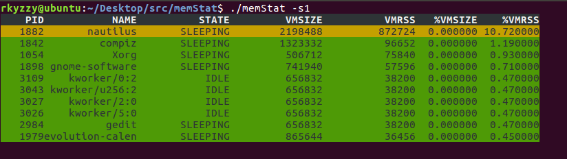

# CS302 Project Final Report

#### --11812202 Weibao Fu

#### --11810935 Lan Lu

#### --11811127 Ziyue Zhou


## Result Analysis

#### 1)How we met expected goals:


1. **Collect real-time memory usage statistics from every existed process**

   


2. **Rank and display memory usage statistics.**

   The memory usage statistics can be sorted by 4 parameters, `PID` , `VMRSS`, `VMSIZE` ,`VMSTATE` :

   Sorted by `PID` (`-s0`):

   

   Sorted by `VMRSS`(`-s1`):

   

   Sorted by `VMSIZE`(`-s2`):

   

   (?)

   Sorted by `STATE`:

   

   ```
   RUNNING > SLEEPING > IDLE > ZOMBIE > WAITING > STOPPED
   ```

   

   ***For a test program like this:***

   

   ***Here are the following result analysis according to the test:***

   

3. **Detect and record memory allocation  and release status for specific processes.**

   

   Memory allocation and release status is recorded and written into a file in a format as above.

   The format:

   ```
   [Free/Allocated Memory]
   File: <File path directory>
   Line: <The line that convokes the memory allocation or free>
   Size: <The size of memory allocated or freed>
   ```

   

4. **Detect and record file handle allocation  and release status for specific processes.**

   

   File handle allocation and release status is also recorded and written into a file as a format above

   ```
   [Closed/Opened File]
   File: <File path directory>
   File Descriptor: <The file descriptor it returns>
   Line: <The line that convokes the file open or close>
   ```

   

5. **Detect and report potential memory leak according to the tracked allocation and release information.**

   

   

   It will print out a Memory Leak Summary report at the end.

   It records

   (1) `Leak Total Num` : The total number of memory leak

   (2) `Leak Total Size`:  The total size of memory leak

   (3) `Max used` : The max total memory it uses during this time period

   (4) `Once Max` : The max amount of memory allocated at one allocation

   For each memory leak, it has the following format:

   ```
   Address: <The address in the memory where memory leak happens>
   Size: <The size of memory it leaks>
   File Name: <The file that the leakage happens>
   Line: <The line that causes the leakage happens>
   ```

   

6. **Pack the above features together as our final memory tracker.**

#TODO

#### 2) More Advanced goals acheived:


#### 3) Goals that are not implemented and its difficulties:

1. Detect and alert potential memory overflow or underflow especially caused by read and write.
2. Detect and alert use on uninitialized memory.
3. Detect and alert read and write operations on memory after it has been freed.
4. Detect and alert use on memory beyond the allocated size.
5. Detect and alert invalid access to heap and stack.


## Implementation

#### 1) Overall Implementation ideas:


#### 2) Specific implementation for each important function:


## Future Direction

Abaaba


## Summary

#### 1)Main techniques we learnt in the project


#### 2)Experience of teamwork


## Division of labor

**Weibao Fu's work:**

**Lan Lu's work:**

**Ziyue Zhou's work:**